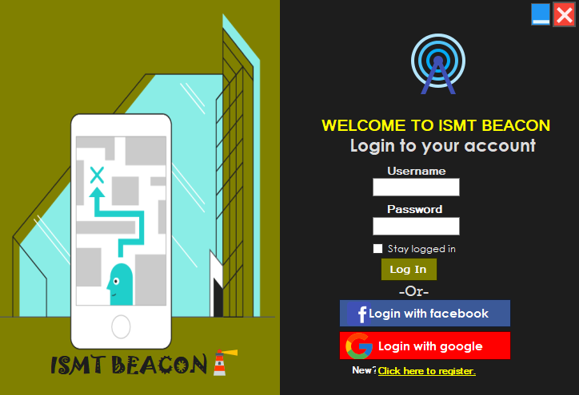

# Beacon Management System

Beacon management system is the desktop application using c# language. The application contains forms like login, registration, dashboard, admin, beacon, client, area, ad, beacon_ad, click and impression. Each module has two forms; one is for viewing records and another is for adding new records. The users have to provide valid username and password to login to their account. 

---

## Login credentials

- username: sandip
- password: sandip123

---

## Applications required

- Microsoft Visual Studio as IDE
- Web browser (Google Chrome or Microsoft Edge or Safari or any other)
- Local web server (XAMPP or WAMP or LAMP  or MAMP)

---

## Steps to follow

1. Download and extract zip file.
2. Using phpMyAdmin, create a database named 'beacon_management_tool' and import database file 'beacon_management_tool.sql'.
3. Run projectfirst.sln with Visual Studio.
5. Start the application.

---

## Features

1. Registration form- The form where user can register a new account.
2. Login form- The form from where user or admin can login into their account by providing username and password. Parameterized query has been used in the login form to prevent SQL injection.
3. Dashboard- The form from where user can select forms to enter inside.
4. Admin form- The form where records of admin can be viewed and new admin can be inserted by providing admin’s information like name, email, password, mobile number and date of birth.
5. Client form- The form where records of client can be viewed and new client can be inserted by providing client’s name, email, address, description and date of birth.
6. Areas form- The form where records of area can be viewed and new area can be inserted by providing area’s name and description.
7. Beacon_ad form- The form where records of beacon_ad can be viewed and new beacon_ad can be inserted by providing ad id and beacon id.
9. Ad form- The form where records of ad can be viewed and new ad can be inserted by providing ad’s information like title, description, start date and end date.
10. Click form- The form where records of click can be viewed and new click can be inserted by providing datetime and ad id.
11. Impression form- The form where records of impression can be viewed and where new impression can be inserted by providing impression’s information like datetime and ad id.
